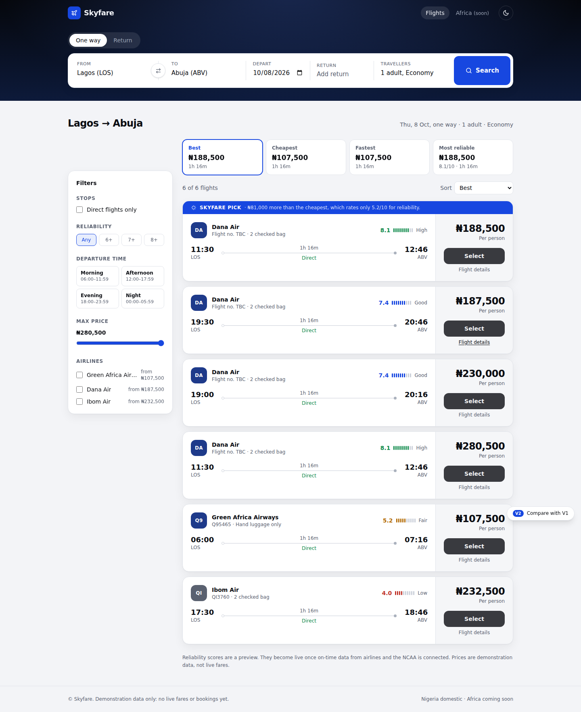

# Skyfare: Nigerian Flight Comparison

Skyfare compares every domestic flight in Nigeria on **price**, **journey time** and **reliability** (a 1–10 on-time score), and highlights one recommended flight, the **Skyfare Pick**. Phase 1 is a web MVP for Nigerian domestic routes; Phase 2 is a mobile app; later phases expand to Africa. See `docs/PHASE_1_PLAN.md`.



## Status

**V2 (`/v2`) is the current design.** It's live on the Vercel preview for the `claude/skyfare-flight-comparison-mvp-o0dqsh` branch (PR #1). V1 is still at `/` with a "Try V2" banner for comparison until V2 becomes the home page.

| Area | State |
|---|---|
| Search, results, sort (Best / Cheapest / Fastest / Most reliable), filters, Skyfare Pick, dark mode | Built (V2), 63 tests passing |
| Flight data | **Test data only** (`MockFlightProvider`). Real sources are recommended and awaiting confirmation; see `docs/DATA_SOURCES.md` |
| Reliability scores | **Preview placeholders**, labelled as such in the UI, until on-time data is connected |
| Booking | Not in scope: Skyfare redirects to the seller. The Select button is disabled until a partner is connected |
| Brand identity | **Undecided.** Three directions with website mockups in `docs/BRAND.md` (Instrument or Harmattan shortlisted) |

**This environment uses MockFlightProvider and has no live flight inventory.** Every price and schedule shown is demonstration data.

## Quick start

```bash
npm install
npm run dev
```

Open http://localhost:3000/v2 and search a route (e.g. Lagos → Abuja). V1 is at http://localhost:3000.

Set `FLIGHT_PROVIDER=mock` (the default). Production-mode builds also need `ALLOW_MOCK_PROVIDER=true`; see `docs/DEVELOPMENT.md`.

## Scripts
`npm run dev` · `npm run build` · `npm run lint` · `npm run typecheck` · `npm test`

## Docs

| Doc | What's in it |
|---|---|
| `docs/PHASE_1_PLAN.md` | Phase 1 plan: research, data strategy, reliability formula, Skyfare Pick logic, sub-phases, open decisions |
| `docs/V2_DESIGN.md` | The V2 layout: what changed from V1, inspiration, design tokens, caveats |
| `docs/BRAND.md` | Three brand identity directions with website mockups (undecided) |
| `docs/DATA_SOURCES.md` | Flight data and API selection, the no-scraping decision, recommended plan |
| `docs/DECISIONS.md` | Decision log, open and resolved |
| `docs/ARCHITECTURE.md` | System design as built |
| `docs/FLIGHT_PROVIDER_INTERFACE.md` | The provider abstraction contract; read before touching `src/lib/flights/` |
| `docs/DATABASE.md` | Schema (defined, not yet connected) |
| `docs/DEVELOPMENT.md` | Setup, scripts, deployment, conventions |

## Known issues

- Several docs and code comments reference earlier research docs (`PHASE_0_5_VALIDATION.md`, `PRD.md`, `TESTING.md`, `PARTNER_OUTREACH_PLAN.md`, `PROVIDER_SCORECARD.md`) that aren't in this repo.

## Working in this repo (for a future dev or AI agent session)
1. Read `docs/FLIGHT_PROVIDER_INTERFACE.md` first if you're touching flight-data code at all.
2. `MockFlightProvider` is the only provider implemented. It is hard-blocked from production unless `ALLOW_MOCK_PROVIDER=true` is explicitly set; don't weaken that check.
3. No provider-specific logic outside a provider's own adapter file. The search engine stays provider-agnostic.
4. New UI work goes in V2 (`src/app/v2`, `src/components/v2`, `src/lib/v2`). Ranking and reliability logic lives in `src/lib/v2/scoring.ts` and is unit tested.
5. Before considering any change done: `npm test && npm run typecheck && npm run lint && npm run build`, all four.
6. Don't build against a data provider's assumed response shape; see `docs/DATA_SOURCES.md` for what's confirmed.
