# Skyfare Brand Identity

**Status: undecided.** Three directions are drafted below, each with a website mockup. No direction is chosen yet. The shortlist is **01 Instrument** and **02 Harmattan**; 03 Signal is kept for reference. Revisit before sub-phase 1.6 (brand guide and assets) in `PHASE_1_PLAN.md`.

The live V2 site (`/v2`) currently uses the **Instrument** palette (blue, silver, black). Applying any other direction is a token swap in `src/app/globals.css` (`.v2` block) plus fonts and logo, not a rebuild.

## Where the files are

| What | Path |
|---|---|
| Identity boards (logo, palette, type, references, distinct feature) | `docs/brand/identities/*.png` and `.html` |
| Website mockups (home, results, mobile results) per identity | `docs/brand/mockups/*.png` and `.html` |
| Editable sources from the design canvas | `docs/brand/source/*.dc.html` |
| Interactive design canvas (private, owner only) | https://claude.ai/artifact/JhAYBzHhkpVFrck9zNXviZ |

The `.html` files open directly in a browser (fonts load from Google Fonts). The PNGs are full-page screenshots of the same files. All mockups use the same demonstration data for Lagos → Abuja so they compare like for like. They are drafts for review, not production code.

To regenerate the HTML and PNGs after editing a source board: `node docs/brand/source/export.js docs/brand/source docs/brand` (needs Playwright).

## Side by side

| | 01 Instrument | 02 Harmattan | 03 Signal |
|---|---|---|---|
| Idea | Skyfare as a precision tool: cockpit glass display meets Swiss chronograph | Skyfare as a proudly Nigerian travel companion | Skyfare as the airport's own information system |
| Personality | Precise, calm, premium | Warm, proud, reassuring | Bold, honest, no-nonsense |
| Speaks to | Frequent and business flyers | Families, diaspora, leisure | Price-savvy, mobile-first, under 35 |
| Palette | Cockpit Black `#07080B`, Panel `#111318`, Signal Blue `#1747E0`, Night Blue `#4C7DFF`, Aluminium `#B8BEC8`, Cloud `#F1F3F6` | Adire Indigo `#1F2A6B`, Laterite `#B84A24`, Dry-season Sun `#E8A33D`, Palm `#2F6B4F`, Harmattan Sand `#F3EBDD`, Charcoal `#1A1714` | Signal Yellow `#FFC72C`, Asphalt `#111111`, Tarmac `#2A2A2A`, Runway White `#F4F4EF`, On-time Teal `#0B8F8F`, Delay Orange `#FF8A2B` |
| Heading font | Sora | Bricolage Grotesque | Archivo (condensed, caps) |
| Body font | IBM Plex Sans | DM Sans | Public Sans |
| Logo | **The Dial**: a 270° gauge with the arc at 8/10, so the mark is itself a reliability score | **First Light**: sun rising over the horizon, crossed by a dotted flight path; lowercase wordmark | **Gate Arrow**: up-and-right wayfinding arrow on a yellow tile, docked to a condensed name bar |
| Distinct feature | **Reliability Dial**: every flight's score shown as a mini dial; the loader is the needle sweeping 0 to 10 | **Route Adire**: each route gets its own adire-style pattern generated from its airport codes, used on trip cards and share images | **Departure Board**: results as a split-flap board with RELIABLE / MIXED / OFTEN LATE status tags |
| Visual references | Cockpit glass displays, brushed aluminium fuselage, runway lights at night, Swiss pilot chronographs | Adire eleko cloth (Abeokuta), Harmattan haze over Lagos, laterite roads and oil palms, hand-painted motor-park signage | Solari split-flap boards, airport wayfinding, runway markings, thermal-print boarding passes |
| Risk | Close to many fintech and travel apps; least distinctive | Must stay modern, not craft-market; pattern system needs design work | Yellow-and-black airport style is easy for others to copy |

All fonts are free Google Fonts that also work in React Native (Phase 2).

## 01 Instrument (current palette)

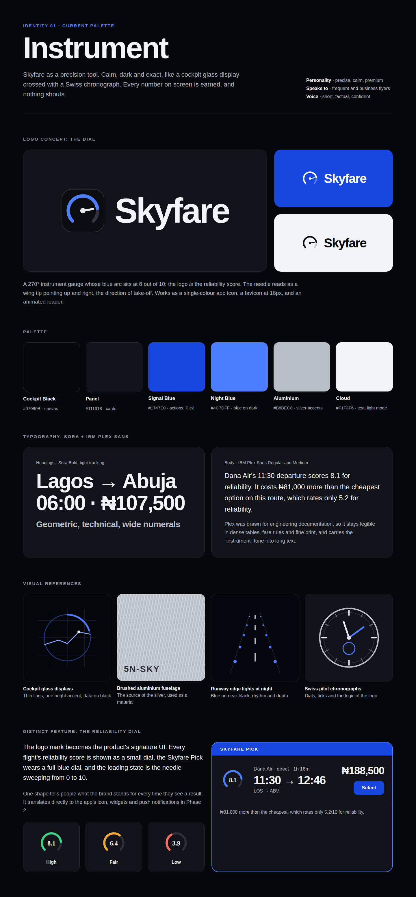

| Home | Results | Mobile |
|---|---|---|
| 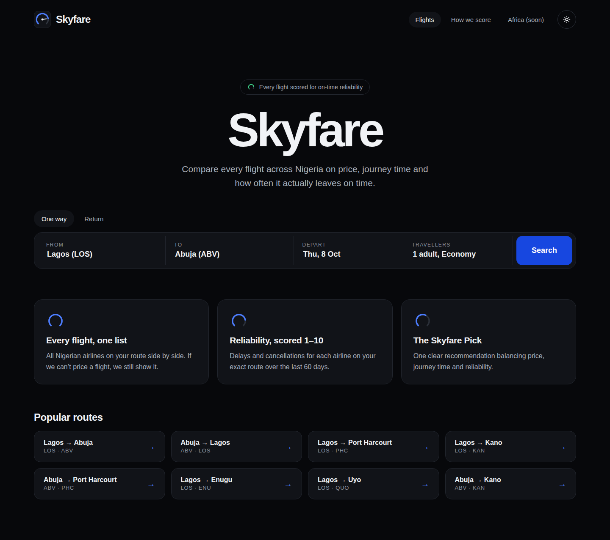 | 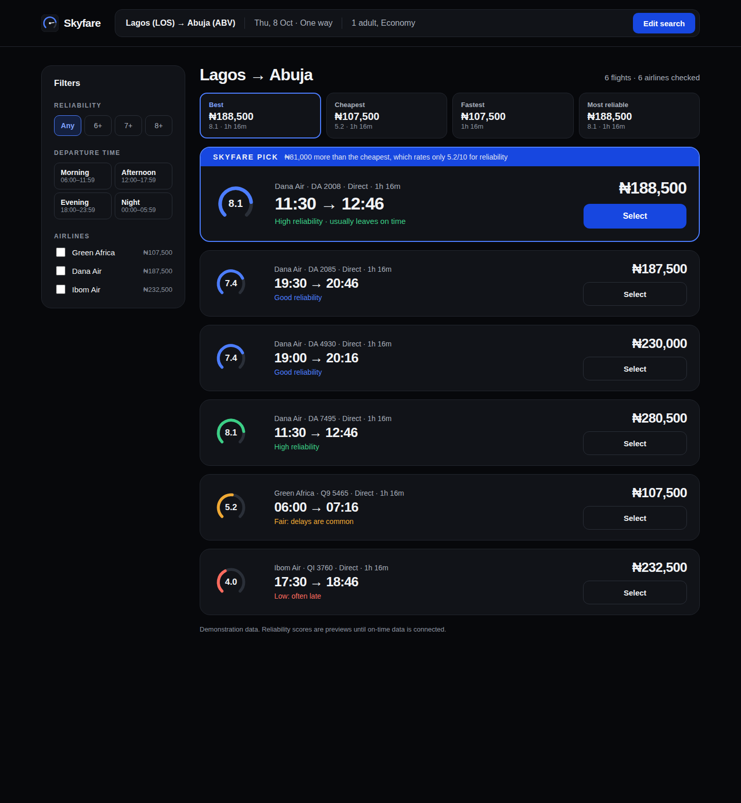 | 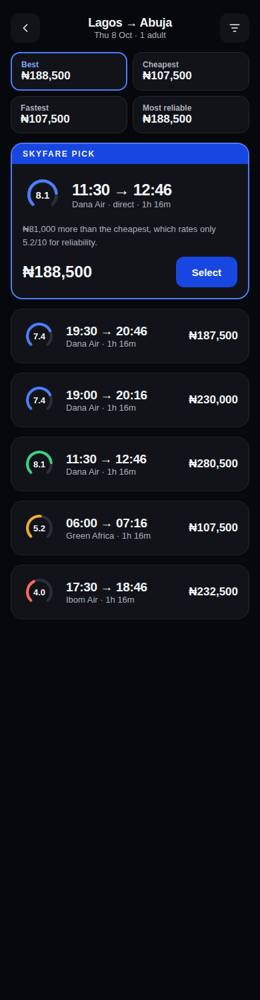 |

## 02 Harmattan

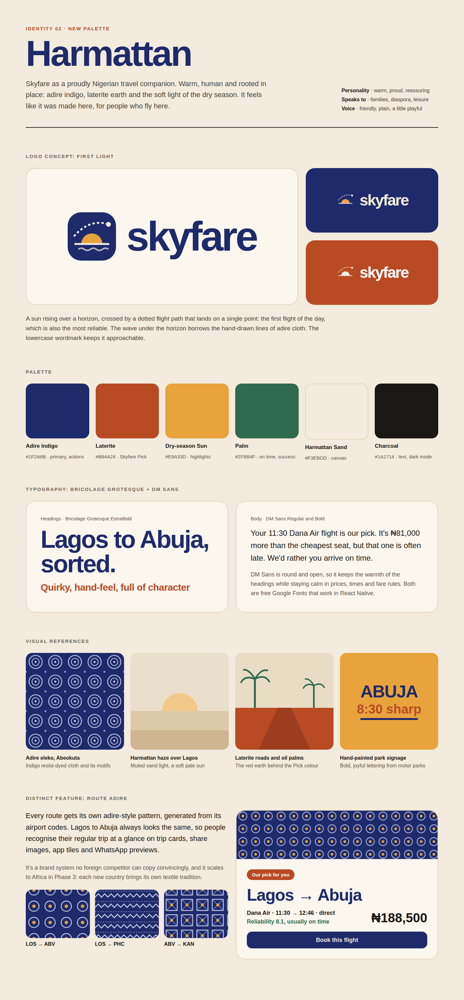

| Home | Results | Mobile |
|---|---|---|
| 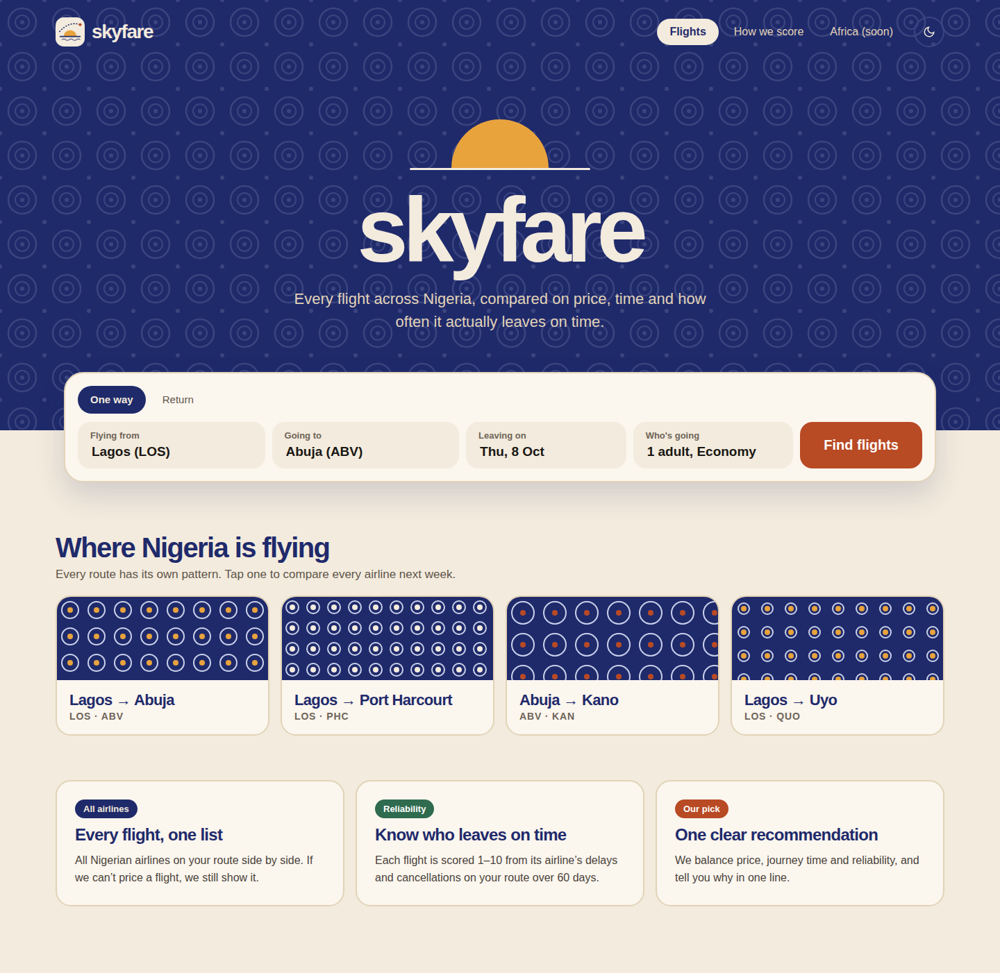 | 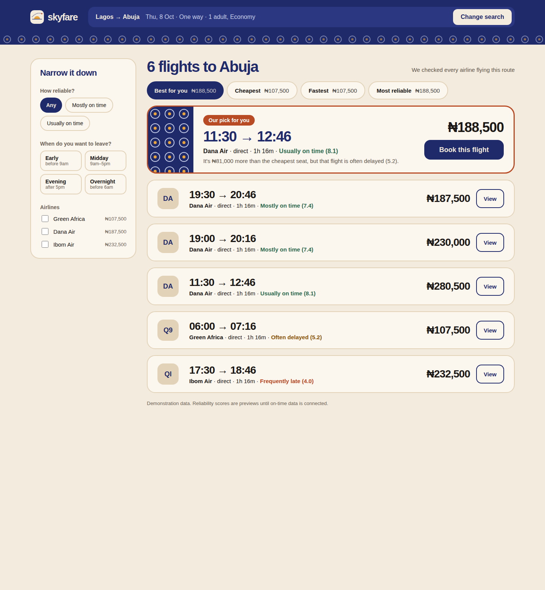 | 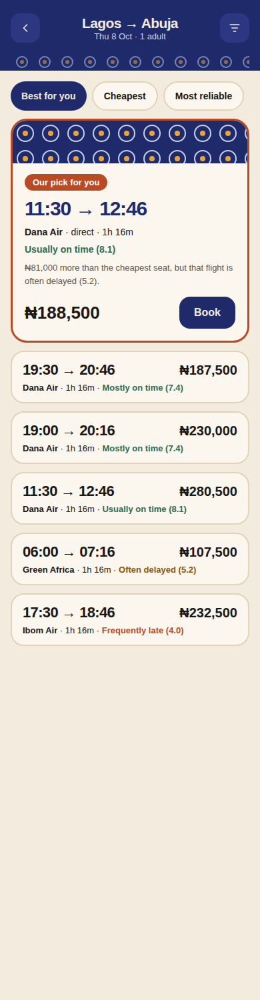 |

## 03 Signal

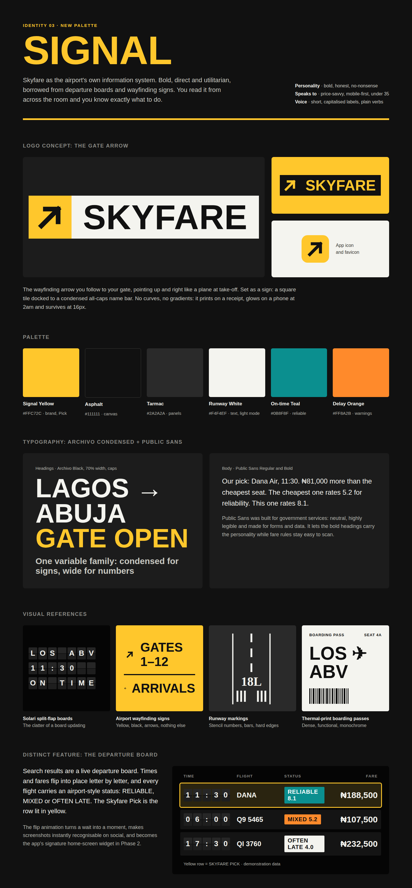

| Home | Results | Mobile |
|---|---|---|
| 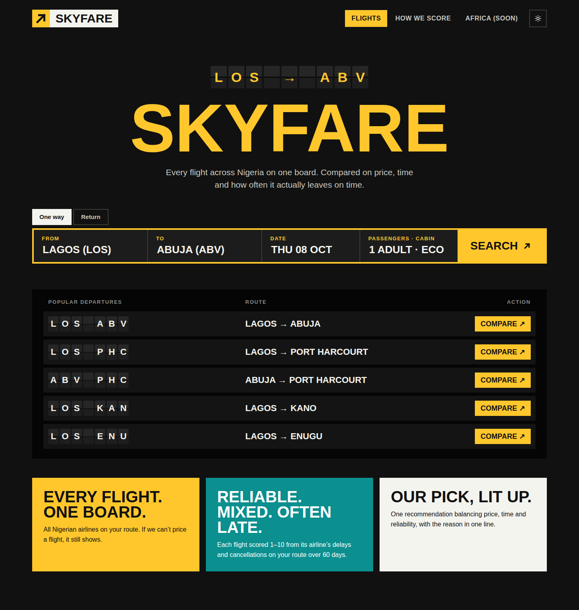 | 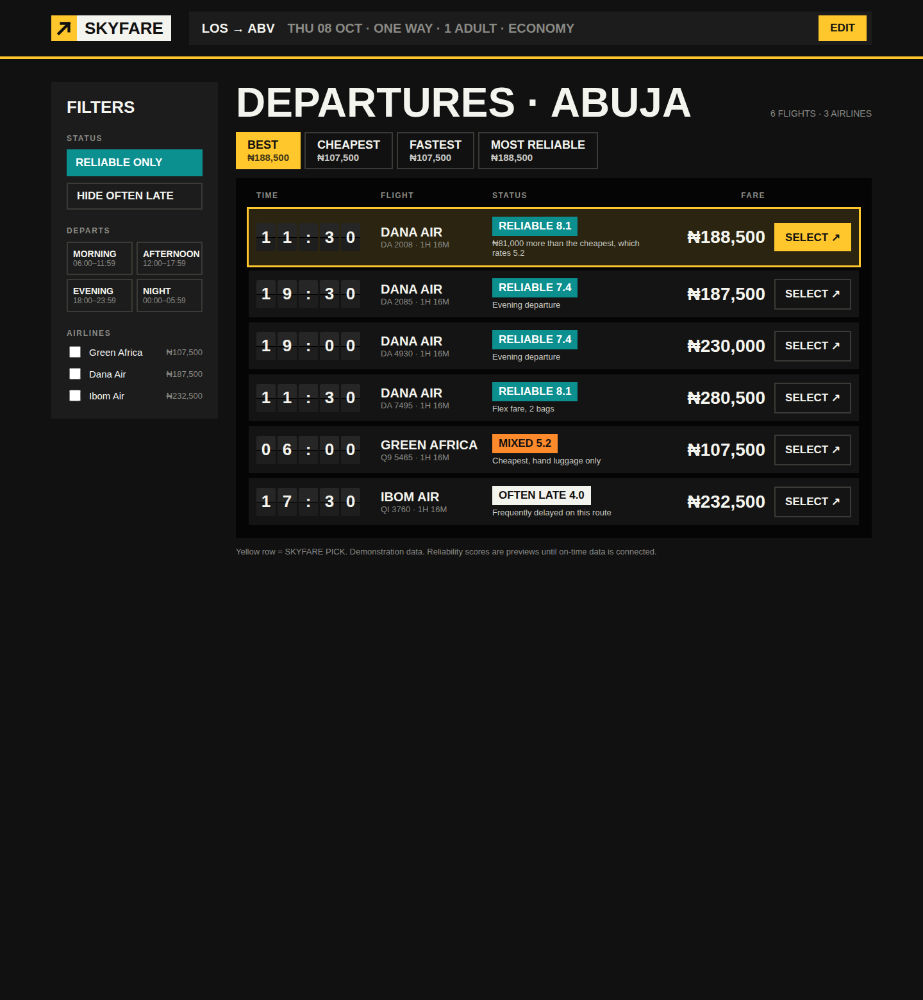 | 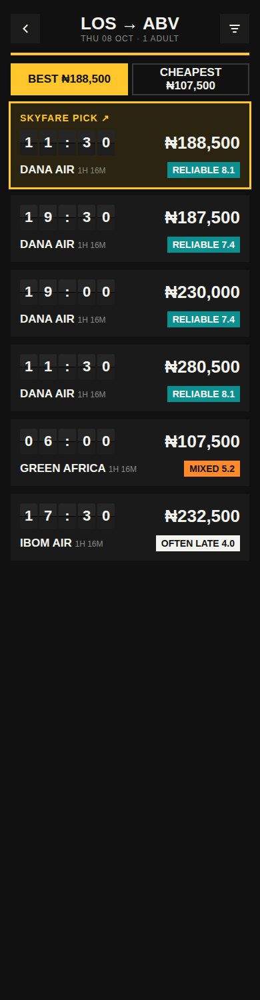 |

## Notes for the decision

- Harmattan's plain-language reliability ("Usually on time", "Often delayed") scans faster than a number on its own. Instrument's dial is the strongest single visual for showing quality at a glance in a long list.
- A hybrid is possible: Harmattan's look with Instrument's dial (drawn in indigo and laterite). Not mocked up yet.
- Harmattan is the hardest for Wakanow, Travelstart or Skyscanner to copy, and Route Adire extends to Africa (each country brings its own textile tradition).
- Before choosing, test both shortlisted mockups with 5 to 10 target users on a phone. The mobile screens are the most representative.

## To do once a direction is chosen

1. Swap the `.v2` tokens and fonts in `src/app/globals.css`; replace the header logo.
2. Produce final logo files (SVG, app icon set, favicon), OG/share images and a short brand guide (sub-phase 1.6).
3. Rename this doc's status to **Decided** and record the decision in `DECISIONS.md`.
